# 操作系统模拟程序文档

## 概述

本项目是一个用C语言实现的操作系统模拟程序，旨在模拟现代操作系统的核心功能和基本组件。通过命令行界面，用户可以交互式地体验操作系统的工作原理，包括进程管理、内存分配、文件系统操作以及中断处理等关键特性。该模拟程序不仅是学习操作系统原理的实用工具，也是理解系统底层机制的直观演示平台。

本模拟系统实现了操作系统的四个主要子系统：进程管理器、内存管理器、文件系统和中断处理器，为用户提供了一个简化但功能完整的操作系统环境。

## 功能描述

### 1. 进程管理
- **进程创建与终止**：支持动态创建新进程并分配资源，进程完成后自动回收资源
- **进程调度算法**：实现了三种经典调度算法
  - 先来先服务(FCFS)：按进程创建顺序调度
  - 优先级调度：根据进程优先级决定执行顺序
  - 时间片轮转(RR)：为每个进程分配固定时间片，实现多任务
- **进程状态管理**：实现进程的运行、就绪、阻塞和终止状态及其转换
- **进程队列**：维护就绪队列和阻塞队列，动态管理进程状态

### 2. 内存管理
- **内存分配算法**：实现最佳适应(Best-Fit)分配策略
- **动态内存分配**：根据进程需求动态分配内存空间
- **内存回收与碎片合并**：进程终止后自动回收内存并合并相邻空闲块
- **内存使用可视化**：提供内存使用情况的图形化展示

### 3. 文件系统
- **多级目录结构**：实现树形目录结构，支持目录层次管理
- **文件操作**：支持文件的创建、删除等基本操作
- **目录操作**：支持目录的创建、删除、切换和列表显示
- **磁盘空间管理**：实现磁盘块的分配和回收机制

### 4. 中断处理
- **时钟中断**：模拟系统时钟，驱动进程调度和时间片管理
- **I/O中断**：模拟I/O设备完成操作后的中断处理
- **用户中断**：支持用户手动触发中断和恢复，实现进程暂停和恢复
- **中断响应机制**：实现中断检测、保存现场、中断处理和恢复现场流程

### 5. 用户交互
- **命令行界面**：提供丰富的命令集供用户操作系统功能
- **运行模式切换**：支持自动运行和手动控制两种模式
- **系统状态显示**：可查看进程、内存、文件系统和中断状态
- **帮助系统**：提供命令帮助和使用说明

## 运行环境

- **操作系统**：Windows 10/11
- **处理器**：支持x86或x64架构的处理器
- **内存要求**：至少256MB可用RAM
- **存储空间**：约10MB可用磁盘空间
- **依赖库**：
  - C标准库
  - Windows API (用于线程管理)
- **终端支持**：支持ANSI转义序列的命令行终端

## 开发环境

- **集成开发环境**：CLion 2023或更高版本
- **编程语言**：C语言(C99标准)
- **编译器**：MinGW GCC 11.0+
- **构建系统**：CMake 3.20+
- **版本控制**：Git
- **代码风格**：遵循Google C++风格指南(适用于C的部分)
- **调试工具**：
  - CLion内置调试器
  - 自定义日志输出系统

## 设计思想

### 模块化架构
系统采用高内聚、低耦合的模块化设计，将不同功能组织为独立但相互协作的模块。主要模块包括进程管理器、内存管理器、文件系统和中断处理器，每个模块都有明确的责任边界和接口定义，便于开发、测试和扩展。

### 数据结构选择
- **进程控制块(PCB)**：使用结构体表示进程的所有信息，通过链表组织多个进程
- **内存块表示**：采用链表结构管理内存，每个节点包含起始地址、大小和分配状态
- **文件控制块(FCB)**：使用结构体表示文件元数据，通过树形结构组织目录层次
- **中断队列**：使用队列结构管理多个中断请求，确保按优先级处理

### 资源管理策略
- **进程调度**：根据不同调度算法决定CPU分配
- **内存分配**：采用最佳适应算法减少内存碎片
- **磁盘空间管理**：实现基于位图的空闲块跟踪
- **中断处理**：设计优先级机制保证重要中断及时响应

### 状态转换模型
系统中各实体(如进程)的生命周期通过明确定义的状态转换来管理。进程可以在运行、就绪、阻塞和终止状态之间转换，状态转换由事件(如时间片耗尽、I/O请求、中断触发)驱动。

### 命令处理机制
系统采用命令解析器模式处理用户输入，将命令字符串解析为操作码和参数，然后调用相应的处理函数。这种设计使命令处理逻辑清晰，便于扩展新命令。

### 用户交互设计
- **命令行界面**：提供简洁直观的交互方式
- **状态可视化**：通过格式化输出展示系统状态
- **实时反馈**：操作执行后立即显示结果
- **错误处理**：提供友好的错误信息和处理机制

### 模拟与实际系统的平衡
本系统在保持概念准确性的同时，适当简化了实现复杂度。例如，使用软件模拟代替硬件中断，简化了文件系统的物理结构等，这些设计决策在保证教学价值的同时提高了系统的可理解性和可实现性。

## 软件设计构思

### 整体架构
本系统采用经典的分层架构，从下至上可分为四个主要层次：
1. **硬件抽象层**：模拟硬件资源(CPU、内存、磁盘)和基础机制(中断)
2. **核心管理层**：包括进程管理、内存管理、文件系统管理和中断处理子系统
3. **系统服务层**：提供资源分配、进程调度、I/O处理等服务
4. **用户接口层**：提供命令解析和执行、状态显示等功能

### 系统工作流程
1. **系统初始化**：
   - 初始化内存结构(一个大的空闲内存块)
   - 建立文件系统根目录
   - 设置调度算法(默认为时间片轮转)
   - 启动系统计时器

2. **命令处理循环**：
   - 接收用户输入命令
   - 解析命令和参数
   - 执行相应功能
   - 返回操作结果

3. **进程生命周期管理**：
   - 进程创建：分配PCB、申请内存、初始化状态
   - 进程调度：根据算法选择下一个运行的进程
   - 进程执行：模拟进程运行，消耗时间片
   - 进程阻塞/唤醒：处理I/O等待和完成
   - 进程终止：释放资源，回收PCB

4. **资源管理机制**：
   - 内存动态分配与回收
   - 磁盘空间管理
   - CPU时间分配

### 模块间通信与协作
- **进程管理与内存管理**：进程创建时申请内存，终止时释放内存
- **进程管理与中断系统**：时钟中断驱动进程调度，I/O中断触发进程状态转换
- **文件系统与内存管理**：文件操作涉及内存与磁盘间的数据传输
- **用户接口与各子系统**：命令解析后调用相应模块的功能

### 扩展性设计
系统设计考虑了未来可能的扩展，预留了接口和扩展点：
- 新调度算法的添加
- 更复杂的内存管理策略(如分页、分段)
- 文件系统功能增强(如权限控制、文件读写操作)
- 更多类型的中断处理

## 关键技术与算法

### 进程调度算法
1. **先来先服务(FCFS)算法**
   - **原理**：按照进程进入就绪队列的顺序分配CPU
   - **实现**：就绪队列采用先进先出(FIFO)方式组织
   - **特点**：实现简单，但对短进程不利，可能导致平均等待时间较长

2. **优先级调度算法**
   - **原理**：选择优先级最高的进程先执行
   - **实现**：就绪队列按优先级排序，每次取队首进程
   - **特点**：照顾重要进程，但可能导致优先级低的进程饥饿

3. **时间片轮转(RR)算法**
   - **原理**：为每个进程分配固定时间片，时间片用完轮到下一个
   - **实现**：维护循环队列，时间片耗尽后进程移至队尾
   - **特点**：公平分配CPU时间，适合交互式系统，但上下文切换开销大

### 内存管理算法
1. **最佳适应(Best-Fit)算法**
   - **原理**：从所有空闲块中找出满足需求的最小空闲块
   - **实现**：遍历空闲块链表，选择满足大小且剩余空间最小的块
   - **时间复杂度**：O(n)，其中n为空闲块数量
   - **特点**：减少大空闲块的浪费，但易产生难以利用的小碎片

2. **内存碎片合并算法**
   - **原理**：释放内存时检测并合并相邻空闲块
   - **实现**：遍历内存块链表，合并物理地址相邻的空闲块
   - **时间复杂度**：O(n²)，最坏情况下可能需要多次遍历
   - **优化**：使用标记-清除方法，减少遍历次数

### 文件系统算法
1. **文件索引与查找**
   - **原理**：利用目录树结构组织文件
   - **实现**：递归遍历目录树查找文件
   - **时间复杂度**：O(h)，其中h为目录树高度

2. **磁盘块分配算法**
   - **原理**：使用位图表示磁盘块使用情况
   - **实现**：扫描位图找到连续的空闲块
   - **时间复杂度**：O(b)，其中b为磁盘块总数

### 中断处理机制
1. **中断检测与响应**
   - **原理**：系统定期检查中断标志
   - **实现**：在时钟中断处理中检查其他中断源
   - **特点**：软件模拟，避免硬件复杂性

2. **中断处理优先级机制**
   - **原理**：不同类型中断有不同优先级
   - **实现**：根据中断类型决定处理顺序
   - **特点**：确保重要中断及时处理

## 基本数据结构

### 进程控制块(PCB)
```c
typedef struct PCB {
    int pid;                // 进程ID
    char name[32];          // 进程名称
    ProcessState state;     // 进程状态(就绪、运行、阻塞)
    int priority;           // 优先级
    int time_slice;         // 分配的时间片
    int memory_size;        // 内存大小
    int memory_start;       // 内存起始地址
    struct PCB *next;       // 指向下一个PCB的指针
} PCB;
```

进程控制块是进程管理的核心数据结构，记录了进程的所有属性和状态信息。系统通过链表组织多个PCB，分别形成就绪队列、阻塞队列等。

### 内存块结构
```c
typedef struct MemoryBlock {
    int start_address;      // 内存块起始地址
    int size;               // 内存块大小
    bool is_allocated;      // 是否已分配
    int pid;                // 占用该内存块的进程ID
    struct MemoryBlock *next; // 下一个内存块
} MemoryBlock;
```

内存块结构用于表示系统内存的分配状态。通过链表连接所有内存块，既包括已分配块也包括空闲块，支持动态分割、合并和分配。

### 文件控制块(FCB)
```c
typedef struct FCB {
    char name[32];          // 文件名
    FileType type;          // 文件类型(普通文件/目录)
    int size;               // 文件大小
    int first_block;        // 首块号
    struct FCB *parent;     // 父目录
    struct FCB *child;      // 子文件/目录(仅目录有效)
    struct FCB *sibling;    // 兄弟文件/目录
} FCB;
```

文件控制块存储文件的元数据信息。系统使用树形结构组织FCB，实现多级目录层次。目录FCB通过child和sibling指针管理其包含的文件和子目录。

### 磁盘块结构
```c
typedef struct {
    bool is_used;           // 是否使用
    int next_block;         // 下一块编号(-1表示文件结束)
} DiskBlock;
```

磁盘块结构表示磁盘的基本存储单元。通过next_block字段实现文件块的链接，形成文件的物理存储结构。系统还维护一个位图用于快速查找空闲块。

### 中断相关结构
```c
// 中断类型枚举
typedef enum {
    TIMER_INTERRUPT,
    IO_INTERRUPT,
    SYSTEM_CALL,
    USER_INTERRUPT
} InterruptType;

// 系统中断状态变量
bool system_interrupt_flag;
PCB* interrupted_process;
```

中断处理使用标志变量和指针记录中断状态和被中断进程，实现中断的触发、响应和恢复流程。

### 队列管理
系统使用链表实现各种队列:
- **就绪队列**: 等待CPU的进程队列
- **阻塞队列**: 等待I/O或其他事件的进程队列
- **内存块链表**: 系统内存分配状态
- **中断队列**: 待处理的中断请求队列

这些队列的组织方式根据其用途有所不同:
- 就绪队列: 根据调度算法可能是FIFO队列或优先级队列
- 阻塞队列: 通常是FIFO队列
- 内存块链表: 按地址排序的链表
- 中断队列: 按优先级排序的队列

## 基本处理流程

### 系统启动流程
1. **系统初始化**
   - 初始化内存结构（创建一个大的空闲内存块）
   - 初始化文件系统（创建根目录）
   - 设置默认调度算法（时间片轮转RR）
   - 初始化中断处理系统
   - 启动系统计时器

2. **进入命令处理循环**
   - 显示命令提示符
   - 等待用户输入命令
   - 解析并执行命令
   - 返回命令执行结果

### 进程管理流程
1. **进程创建流程**

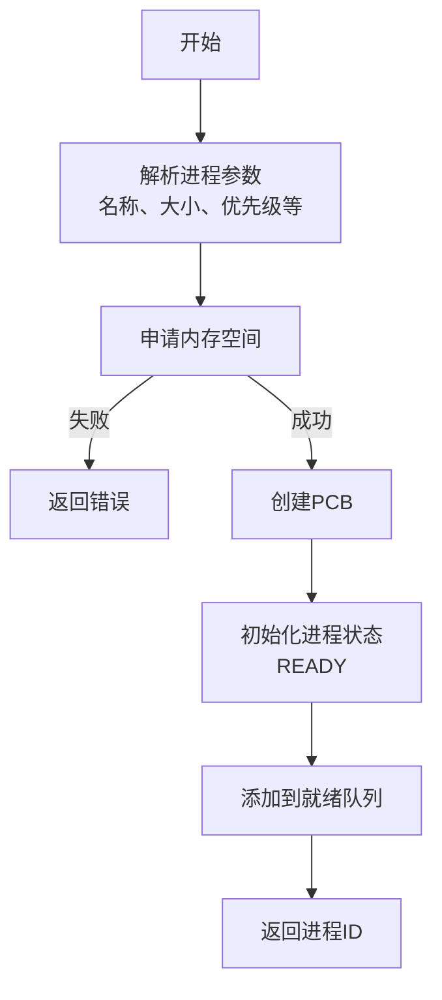

2. **进程调度流程**

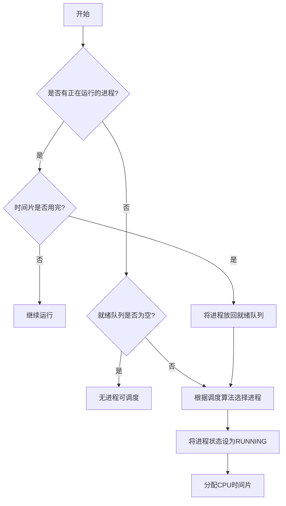

3. **进程终止流程**

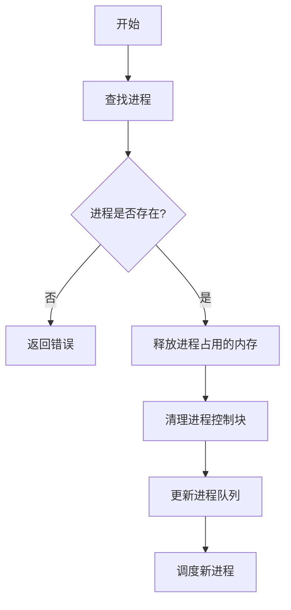

### 内存管理流程
1. **内存分配流程**

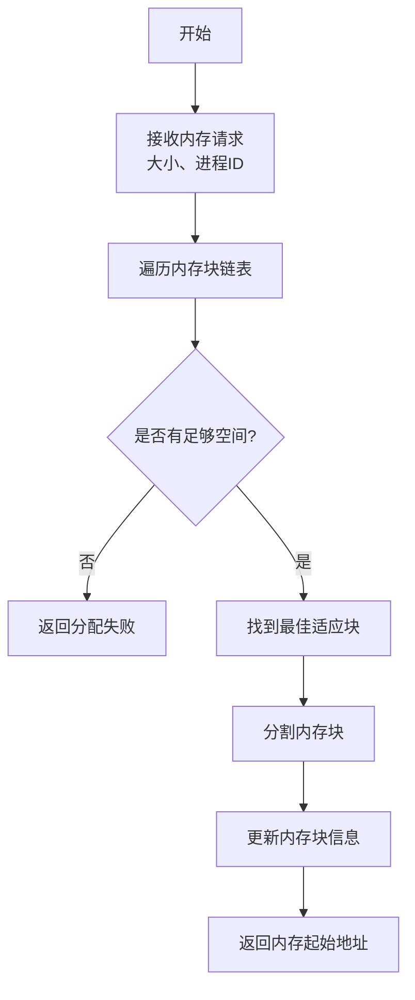

2. **内存释放流程**

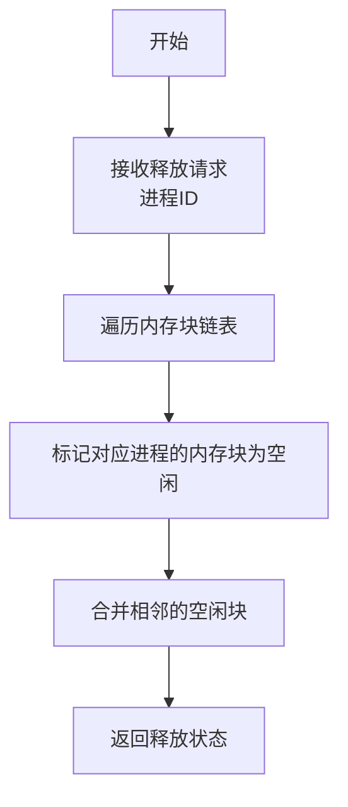

### 文件系统流程
1. **文件创建流程**

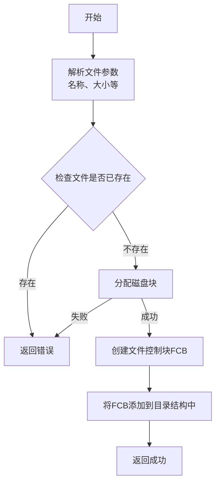

2. **目录操作流程**

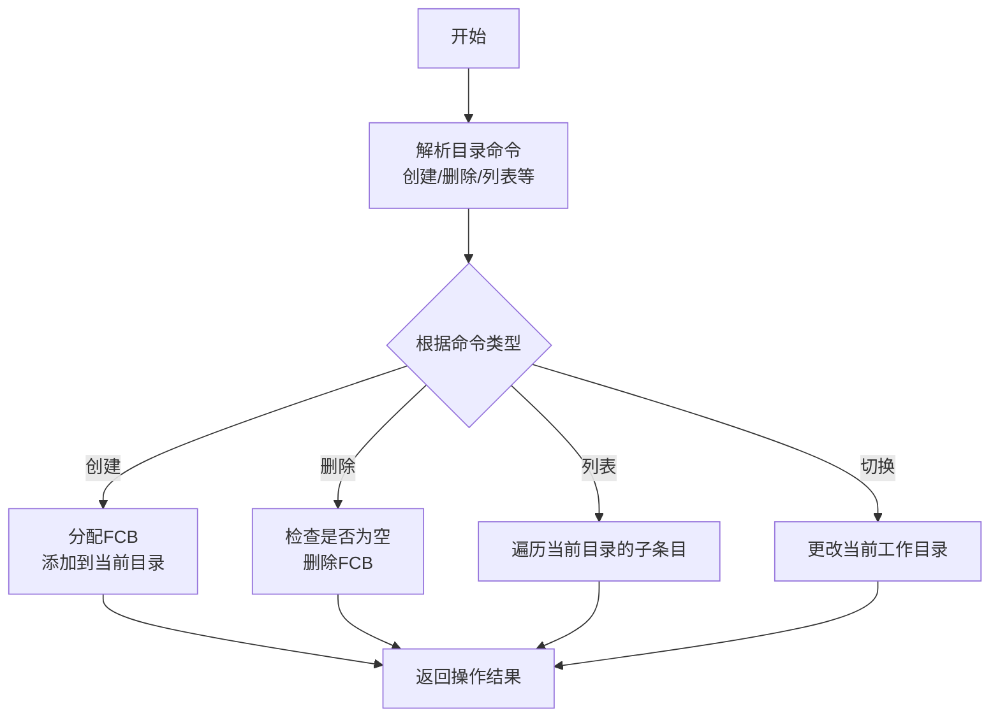

### 中断处理流程
1. **时钟中断处理**

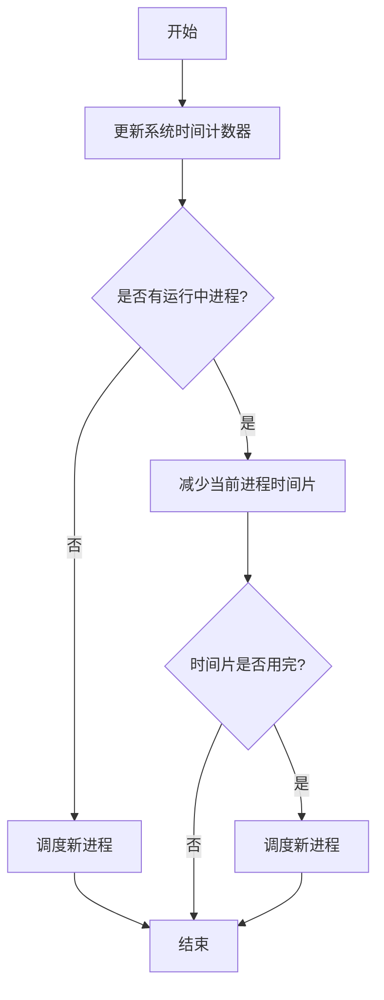

2. **用户中断处理(stop命令)**

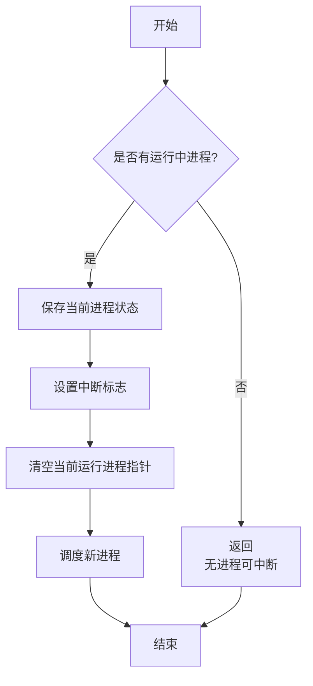

3. **中断恢复流程(recover命令)**

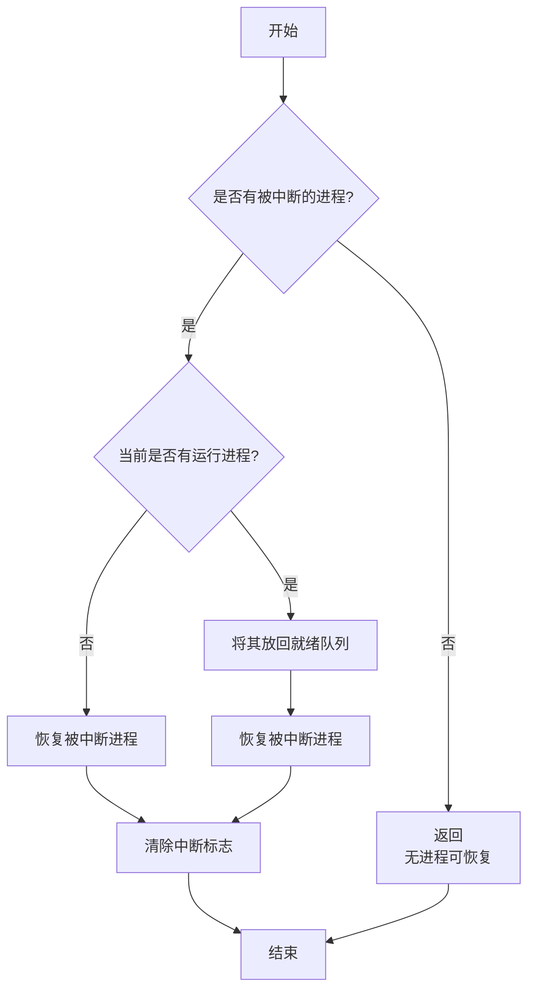

### 系统总体流程图

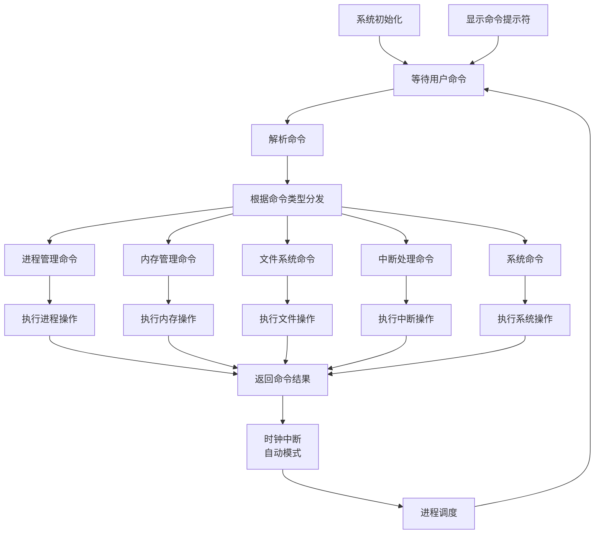

此流程图展示了系统的主要处理流程，包括系统初始化、命令处理循环、各子系统的处理流程以及它们之间的关系。系统通过命令解析器将用户输入的命令分发到相应的子系统进行处理，并在自动模式下通过时钟中断驱动进程调度和系统运行。

## 软件主要模块及其依赖关系说明

### 主要模块概述

本系统由五个主要功能模块组成，每个模块负责操作系统的一个核心功能领域。模块间通过明确定义的接口进行通信，形成有机的整体结构。

#### 1. 进程管理模块
- **核心职责**：创建、调度、控制和终止进程
- **主要组件**：
  - 进程控制块(PCB)管理器
  - 进程队列管理器(就绪队列、阻塞队列)
  - 进程调度器(FCFS、优先级、时间片轮转)
  - 进程状态转换控制器

#### 2. 内存管理模块
- **核心职责**：分配、回收和管理系统内存
- **主要组件**：
  - 内存分配器(最佳适应算法)
  - 内存回收器
  - 内存碎片合并器
  - 内存使用状态跟踪器

#### 3. 文件系统模块
- **核心职责**：管理文件、目录及磁盘空间
- **主要组件**：
  - 文件控制块(FCB)管理器
  - 目录树管理器
  - 磁盘空间分配器
  - 文件操作接口

#### 4. 中断处理模块
- **核心职责**：处理系统中断，协调异步事件
- **主要组件**：
  - 时钟中断处理器
  - I/O中断处理器
  - 用户中断处理器(stop/recover)
  - 中断状态管理器

#### 5. 用户界面与命令处理模块
- **核心职责**：解析用户命令，展示系统状态
- **主要组件**：
  - 命令解析器
  - 命令执行器
  - 状态展示器
  - 帮助系统

### 模块依赖关系

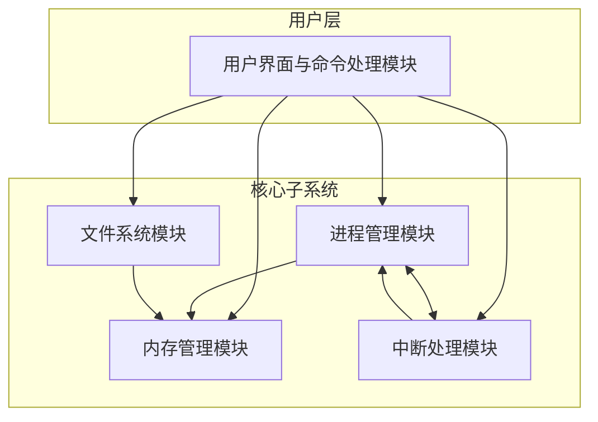

### 主要模块间接口与交互

#### 进程管理模块与内存管理模块
- **接口函数**:
  - `allocate_memory(int size, int pid)`: 进程创建时申请内存
  - `free_memory(int pid)`: 进程终止时释放内存
- **数据交换**:
  - 进程管理模块向内存管理模块提供进程ID和所需内存大小
  - 内存管理模块返回分配的内存起始地址或失败状态

#### 进程管理模块与中断处理模块
- **接口函数**:
  - `handle_timer_interrupt()`: 时钟中断处理，驱动进程调度
  - `handle_system_interrupt()`: 用户中断处理，暂停当前进程
  - `resume_interrupted_process()`: 恢复被中断的进程
- **数据交换**:
  - 中断处理模块控制进程状态转换
  - 进程管理模块提供当前运行进程信息

#### 文件系统模块与内存管理模块
- **接口函数**:
  - (间接关系) 文件系统通过自身的内存缓冲区与内存管理模块交互
- **数据交换**:
  - 文件操作过程中可能需要申请临时内存空间
  - 文件内容在磁盘和内存之间传输

#### 用户界面模块与其他模块
- **接口函数**:
  - `process_command(char *command)`: 解析并分发命令到各模块
  - 各类命令执行函数: `create_process()`, `display_memory()` 等
- **数据交换**:
  - 用户输入的命令和参数
  - 命令执行结果和系统状态信息

### 模块间数据流

1. **命令执行流程**:
   - 用户输入命令 → 命令解析器 → 相应功能模块 → 执行操作 → 返回结果 → 状态展示

2. **进程创建流程**:
   - 命令处理 → 进程管理模块 → 内存申请 → 内存管理模块 → 分配内存 → 返回内存地址 → 创建PCB → 加入就绪队列

3. **中断处理流程**:
   - 中断触发 → 中断处理模块 → 保存当前进程状态 → 进程管理模块 → 调度新进程 → 恢复或继续执行

4. **文件操作流程**:
   - 命令处理 → 文件系统模块 → 找到/创建FCB → 申请磁盘空间 → 更新目录结构 → 返回操作结果

### 模块耦合度分析

本系统在设计时遵循了高内聚、低耦合的原则，各模块间通过明确定义的接口进行交互，减少了相互依赖。

1. **内容耦合 (低)**:
   - 各模块主要通过函数参数和返回值交换数据
   - 避免直接访问其他模块的内部数据结构

2. **公共耦合 (中)**:
   - 系统维护少量全局变量(如当前运行进程指针、中断标志)
   - 这些变量被多个模块访问，但访问方式受控

3. **控制耦合 (低)**:
   - 模块间通过返回状态码或布尔值表示操作结果
   - 避免一个模块直接控制另一个模块的内部流程

4. **数据耦合 (主要)**:
   - 大多数模块交互是通过传递必要的数据参数实现
   - 这种耦合形式是最宽松、最易维护的

## 软件接口设计

本系统采用模块化设计，各功能模块通过定义良好的接口进行交互。以下详细介绍系统内部各模块间的接口设计，包括函数签名、参数、返回值及功能说明。

### 内部接口概述

系统内部接口主要分为四大类：
1. **进程管理接口**：提供进程的创建、调度、终止等操作
2. **内存管理接口**：提供内存空间的分配、释放和管理
3. **文件系统接口**：提供文件和目录的创建、删除、查找等操作
4. **中断处理接口**：提供中断处理和响应机制

### 进程管理模块接口

#### 1. 进程创建接口

```c
PCB* create_process(char *name, int memory_size, int priority, int time_slice);
```

- **功能**：创建新进程，分配内存，初始化PCB，并将进程加入就绪队列
- **参数**：
  - `name`：进程名称
  - `memory_size`：需要分配的内存大小
  - `priority`：进程优先级（数值越小优先级越高）
  - `time_slice`：分配的时间片长度（可选，默认为系统预设值）
- **返回值**：成功返回PCB指针，失败返回NULL
- **调用模块**：用户界面模块、其他需要创建子进程的模块
- **内部调用**：`allocate_memory()`, `add_to_ready_queue()`

#### 2. 进程调度接口

```c
void schedule_process();
```

- **功能**：根据当前调度算法选择下一个运行的进程
- **参数**：无
- **返回值**：无
- **调用模块**：中断处理模块、进程终止和阻塞函数
- **内部调用**：`remove_from_ready_queue()`, 进程状态转换函数

#### 3. 进程终止接口

```c
void terminate_process(int pid);
```

- **功能**：终止指定进程，释放其占用的资源
- **参数**：
  - `pid`：要终止的进程ID
- **返回值**：无
- **调用模块**：用户界面模块、时钟中断处理模块
- **内部调用**：`free_memory()`, `schedule_process()`

#### 4. 进程状态转换接口

```c
void block_process(int pid);
void wakeup_process(int pid);
```

- **功能**：
  - `block_process`：将指定进程状态设为阻塞并移出就绪队列
  - `wakeup_process`：将指定进程从阻塞状态唤醒并加入就绪队列
- **参数**：
  - `pid`：目标进程ID
- **返回值**：无
- **调用模块**：用户界面模块、I/O中断处理模块
- **内部调用**：`add_to_blocked_queue()`, `remove_from_blocked_queue()`, `add_to_ready_queue()`

#### 5. 进程队列管理接口

```c
void add_to_ready_queue(PCB *proc);
PCB* remove_from_ready_queue();
void add_to_blocked_queue(PCB *proc);
PCB* remove_from_blocked_queue(int pid);
```

- **功能**：
  - `add_to_ready_queue`：将进程加入就绪队列
  - `remove_from_ready_queue`：从就绪队列取出下一个待执行进程
  - `add_to_blocked_queue`：将进程加入阻塞队列
  - `remove_from_blocked_queue`：从阻塞队列移除指定进程
- **参数**：
  - `proc`：进程控制块指针
  - `pid`：进程ID
- **返回值**：取出操作返回进程指针，加入操作无返回值
- **调用模块**：进程管理模块内部，中断处理模块
- **内部调用**：无（基本队列操作）

### 内存管理模块接口

#### 1. 内存分配接口

```c
int allocate_memory(int size, int pid);
```

- **功能**：为指定进程分配指定大小的内存
- **参数**：
  - `size`：请求分配的内存大小
  - `pid`：请求内存的进程ID
- **返回值**：成功返回分配的内存起始地址，失败返回-1
- **调用模块**：进程管理模块
- **内部调用**：最佳适应算法实现函数

#### 2. 内存释放接口

```c
void free_memory(int pid);
```

- **功能**：释放指定进程占用的所有内存
- **参数**：
  - `pid`：要释放内存的进程ID
- **返回值**：无
- **调用模块**：进程管理模块（在进程终止时）
- **内部调用**：内存碎片合并函数

#### 3. 内存状态查询接口

```c
void display_memory();
```

- **功能**：显示当前内存使用情况
- **参数**：无
- **返回值**：无
- **调用模块**：用户界面模块
- **内部调用**：内存遍历和显示函数

### 文件系统模块接口

#### 1. 文件创建接口

```c
FCB* create_file(const char* name, FileType type, FCB* parent);
```

- **功能**：在指定目录下创建新文件或目录
- **参数**：
  - `name`：文件名
  - `type`：文件类型（普通文件/目录）
  - `parent`：父目录FCB指针
- **返回值**：成功返回新创建的FCB指针，失败返回NULL
- **调用模块**：用户界面模块
- **内部调用**：`allocate_disk_block()`

#### 2. 文件删除接口

```c
void delete_file(FCB* file);
```

- **功能**：删除指定文件或目录
- **参数**：
  - `file`：要删除的文件FCB指针
- **返回值**：无
- **调用模块**：用户界面模块
- **内部调用**：`free_disk_block()`

#### 3. 目录操作接口

```c
void list_directory(FCB* dir);
FCB* find_file(FCB* dir, const char* name);
FCB* change_directory(const char* path);
```

- **功能**：
  - `list_directory`：列出指定目录下的所有文件和子目录
  - `find_file`：在指定目录下查找特定名称的文件或子目录
  - `change_directory`：根据路径切换当前工作目录
- **参数**：
  - `dir`：目录FCB指针
  - `name`：文件名
  - `path`：目录路径
- **返回值**：查找和切换操作返回FCB指针，列表操作无返回值
- **调用模块**：用户界面模块
- **内部调用**：递归目录遍历函数

#### 4. 磁盘空间管理接口

```c
int allocate_disk_block(int count);
void free_disk_block(int first_block);
```

- **功能**：
  - `allocate_disk_block`：分配指定数量的连续磁盘块
  - `free_disk_block`：释放以指定块为首的一系列磁盘块
- **参数**：
  - `count`：请求的磁盘块数量
  - `first_block`：要释放的首块编号
- **返回值**：分配操作返回首块编号，失败返回-1；释放操作无返回值
- **调用模块**：文件系统模块内部
- **内部调用**：磁盘位图操作函数

### 中断处理模块接口

#### 1. 中断响应接口

```c
void handle_timer_interrupt();
void handle_system_interrupt();
```

- **功能**：
  - `handle_timer_interrupt`：处理时钟中断，更新进程时间片管理
  - `handle_system_interrupt`：处理用户触发的系统中断，暂停当前进程
- **参数**：无
- **返回值**：无
- **调用模块**：系统计时器，用户界面模块
- **内部调用**：`schedule_process()`

#### 2. 中断恢复接口

```c
void resume_interrupted_process();
```

- **功能**：恢复之前被中断的进程
- **参数**：无
- **返回值**：无
- **调用模块**：用户界面模块
- **内部调用**：进程状态转换函数

#### 3. 中断状态管理接口

```c
bool is_system_interrupted();
PCB* get_interrupted_process();
```

- **功能**：
  - `is_system_interrupted`：检查系统是否处于中断状态
  - `get_interrupted_process`：获取被中断的进程
- **参数**：无
- **返回值**：中断状态或被中断进程的PCB指针
- **调用模块**：系统各模块
- **内部调用**：无（直接访问中断状态变量）

### 内部接口调用关系图

下图展示了系统主要模块间的接口调用关系：

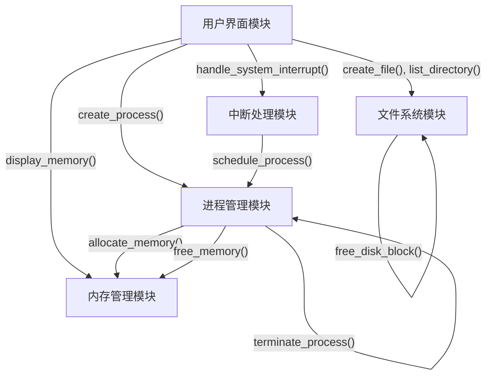

### 接口调用序列示例

以下是一些典型操作的接口调用序列：

#### 1. 进程创建流程

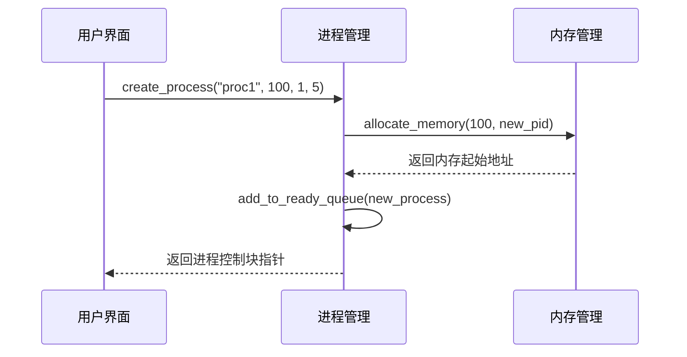

#### 2. 文件创建流程

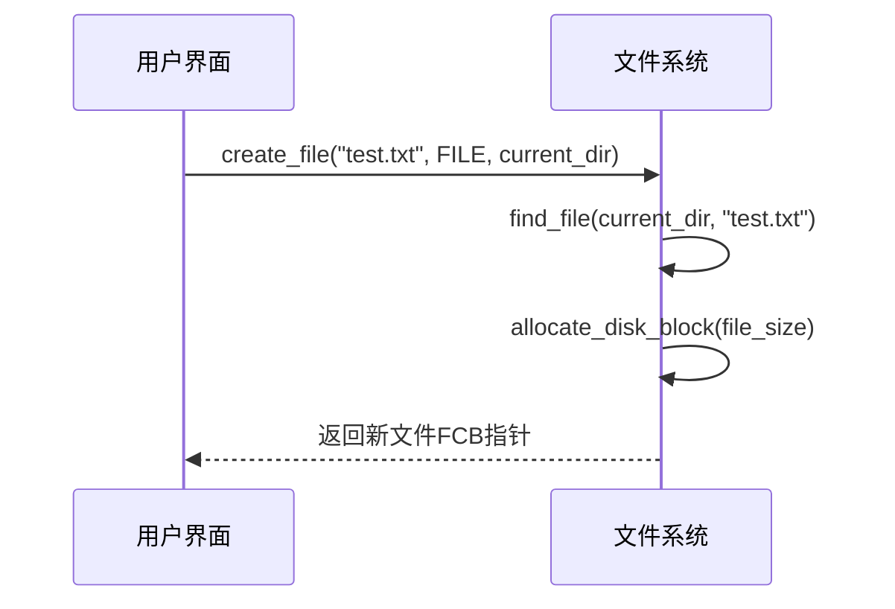

#### 3. 中断处理流程

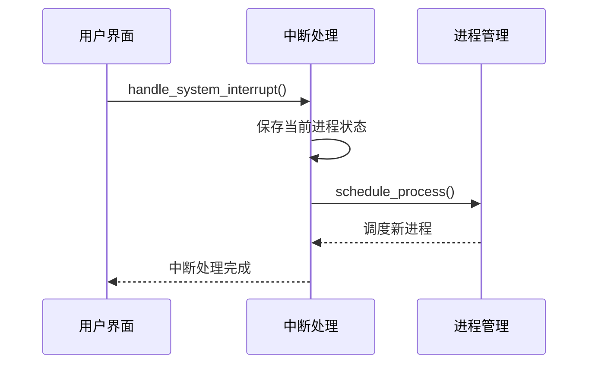

这些接口设计遵循信息隐藏和低耦合原则，每个模块只暴露必要的功能接口，隐藏实现细节，从而提高系统的可维护性和扩展性。接口的参数和返回值设计简洁明了，便于使用和调试。

## 3. 程序单元设计说明

### 3.1 程序单元说明

本系统由五个主要功能单元组成，每个单元负责操作系统的一个核心功能领域。以下是各单元的详细说明。

#### 3.1.1 进程管理单元

**功能职责**：负责进程的创建、调度、控制和终止，维护进程状态和进程队列。

**组成模块**：
1. **进程控制块(PCB)管理器**：负责创建、维护和销毁进程控制块
2. **进程队列管理器**：维护就绪队列和阻塞队列，实现进程按不同策略排队
3. **进程调度器**：实现不同的进程调度算法，选择下一个执行的进程
4. **进程状态管理器**：控制进程状态的转换，包括创建、就绪、运行、阻塞和终止

**功能实现**：
- 进程创建：为进程分配PCB，向内存管理单元申请内存
- 进程终止：释放进程占用的资源，回收PCB
- 进程调度：根据调度算法选择下一个要运行的进程
- 状态管理：控制进程在不同状态间的转换

**设计特点**：
- 采用链表结构管理进程队列，支持动态调整
- 支持多种调度策略，可根据系统需求切换
- 提供清晰的进程状态转换机制，便于跟踪和调试

#### 3.1.2 内存管理单元

**功能职责**：负责内存空间的分配、回收和管理，防止内存碎片，优化内存利用率。

**组成模块**：
1. **内存分配器**：实现最佳适应算法，为进程分配内存空间
2. **内存回收器**：释放进程占用的内存，管理空闲内存块
3. **内存合并器**：合并相邻的空闲内存块，减少内存碎片
4. **内存状态监视器**：跟踪和显示内存使用状态

**功能实现**：
- 内存分配：使用最佳适应算法找到合适的空闲块并分割
- 内存释放：将进程占用的内存标记为空闲
- 碎片合并：定期检查并合并相邻的空闲块
- 状态显示：图形化展示内存使用情况

**设计特点**：
- 使用链表结构管理内存块，支持动态分割和合并
- 内存块按地址排序，便于查找和合并
- 为每个内存块记录进程ID，便于释放和统计

#### 3.1.3 文件系统单元

**功能职责**：管理文件和目录，提供文件操作接口，管理磁盘空间。

**组成模块**：
1. **文件控制块(FCB)管理器**：创建和维护文件元数据
2. **目录管理器**：维护目录结构，支持文件查找和目录操作
3. **磁盘空间管理器**：分配和回收磁盘块，管理磁盘使用情况
4. **文件操作接口**：提供文件创建、删除等基本操作的接口

**功能实现**：
- 文件创建：分配FCB和磁盘块，更新目录结构
- 文件删除：释放磁盘块和FCB，更新父目录
- 目录管理：支持多级目录创建、删除和导航
- 磁盘管理：使用位图记录磁盘块使用情况

**设计特点**：
- 采用树形结构组织目录，支持多级目录
- 文件控制块存储文件元数据，支持不同类型的文件
- 磁盘块通过链接字段构建文件的物理结构

#### 3.1.4 中断处理单元

**功能职责**：处理系统中断，协调异步事件，管理中断响应和恢复过程。

**组成模块**：
1. **时钟中断处理器**：处理系统时钟中断，管理进程时间片
2. **I/O中断处理器**：处理I/O完成事件，唤醒等待的进程
3. **用户中断处理器**：响应用户触发的中断，支持进程暂停和恢复
4. **中断状态管理器**：管理系统中断状态和被中断进程信息

**功能实现**：
- 时钟中断：更新系统时间，减少当前进程时间片，必要时调度新进程
- I/O中断：处理随机产生的I/O完成事件，唤醒对应的阻塞进程
- 用户中断：响应stop命令，保存当前进程状态，调度其他进程
- 中断恢复：响应recover命令，恢复被中断的进程

**设计特点**：
- 通过标志变量和指针管理中断状态
- 提供清晰的中断恢复机制
- 支持多种类型的中断处理

#### 3.1.5 用户界面与命令处理单元

**功能职责**：解析用户命令，调用相应功能模块，展示系统状态。

**组成模块**：
1. **命令解析器**：解析用户输入的命令和参数
2. **命令执行器**：调用相应功能模块执行命令
3. **状态展示器**：格式化显示系统和各模块状态
4. **帮助系统**：提供命令帮助和使用说明

**功能实现**：
- 命令解析：使用字符串处理函数解析命令和参数
- 命令分发：根据命令类型调用相应模块函数
- 状态显示：展示进程、内存、文件系统和中断状态
- 自动/手动模式：支持两种运行模式，自动模式下系统自动运行

**设计特点**：
- 提供简洁、直观的命令行界面
- 命令参数解析灵活，支持多种参数形式
- 格式化输出信息，便于理解和分析

### 3.2 数据结构说明

#### 3.2.1 进程管理数据结构

##### 进程控制块(PCB)

```c
typedef enum {
    READY,      // 就绪状态
    RUNNING,    // 运行状态
    BLOCKED,    // 阻塞状态
    TERMINATED  // 终止状态
} ProcessState;

typedef struct PCB {
    int pid;                // 进程ID
    char name[32];          // 进程名称
    ProcessState state;     // 进程状态
    int priority;           // 优先级(0-10，值越小优先级越高)
    int time_slice;         // 分配的时间片
    int memory_size;        // 内存大小
    int memory_start;       // 内存起始地址
    struct PCB *next;       // 链表指针，指向下一个PCB
} PCB;

// 进程队列相关全局变量
PCB *running_process = NULL;    // 当前运行进程
PCB *ready_queue = NULL;        // 就绪队列头指针
PCB *blocked_queue = NULL;      // 阻塞队列头指针
int next_pid = 1;               // 下一个可用PID
```

**设计说明**：
- PCB包含进程的所有基本信息，便于系统管理和调度
- 使用linked list结构组织进程队列，便于动态调整
- 进程状态使用枚举类型，增强代码可读性
- 使用全局变量和指针追踪不同进程队列和当前运行进程

##### 调度算法相关结构

```c
typedef enum {
    FCFS,       // 先来先服务
    PRIORITY,   // 优先级调度
    RR          // 时间片轮转
} ScheduleAlgorithm;

// 当前调度算法
ScheduleAlgorithm current_algorithm = RR;
```

**设计说明**：
- 使用枚举类型定义支持的调度算法
- 全局变量记录当前使用的调度算法，便于动态切换

#### 3.2.2 内存管理数据结构

##### 内存块结构

```c
typedef struct MemoryBlock {
    int start_address;      // 内存块起始地址
    int size;               // 内存块大小(字节)
    bool is_allocated;      // 分配状态(true:已分配，false:空闲)
    int pid;                // 占用该内存块的进程ID(-1表示空闲)
    struct MemoryBlock *next; // 指向下一个内存块
} MemoryBlock;

// 内存管理全局变量
MemoryBlock *memory = NULL;  // 内存块链表头指针
#define MEMORY_SIZE 1024     // 总内存大小(字节)
```

**设计说明**：
- 内存块结构包含位置、大小和分配状态信息
- 使用链表组织内存块，支持分割、合并和动态管理
- 记录占用进程ID，便于进程终止时释放内存
- 内存块按地址排序，便于相邻块合并

#### 3.2.3 文件系统数据结构

##### 文件控制块(FCB)

```c
typedef enum {
    FILE_TYPE,  // 普通文件
    DIR_TYPE    // 目录
} FileType;

typedef struct FCB {
    char name[32];          // 文件或目录名
    FileType type;          // 类型(普通文件/目录)
    int size;               // 文件大小(字节)
    int first_block;        // 首块号(-1表示无数据块)
    struct FCB *parent;     // 父目录
    struct FCB *child;      // 子文件/目录(仅对目录有效)
    struct FCB *sibling;    // 兄弟文件/目录
} FCB;

// 磁盘块结构
typedef struct {
    bool is_used;           // 使用状态
    int next_block;         // 下一块号(-1表示结束)
} DiskBlock;

// 文件系统全局变量
FCB *root_directory = NULL;  // 根目录
FCB *current_directory = NULL; // 当前工作目录
DiskBlock *disk_blocks = NULL; // 磁盘块数组
#define DISK_SIZE 2048       // 磁盘大小(块数)
#define BLOCK_SIZE 512       // 块大小(字节)
```

**设计说明**：
- FCB存储文件元数据，包括名称、类型、大小等
- 采用树形结构组织目录，parent/child/sibling指针支持复杂目录关系
- 磁盘块结构使用链接字段构建文件物理结构
- 系统维护根目录和当前目录指针，便于文件操作

#### 3.2.4 中断处理数据结构

```c
// 中断类型枚举
typedef enum {
    TIMER_INTERRUPT,
    IO_INTERRUPT,
    SYSTEM_CALL,
    USER_INTERRUPT
} InterruptType;

// 中断相关全局变量
bool system_interrupt_flag = false;     // 中断标志
PCB* interrupted_process = NULL;        // 被中断的进程
int time_counter = 0;                   // 系统时间计数器
```

**设计说明**：
- 中断类型使用枚举定义，便于扩展
- 使用标志变量记录系统是否处于中断状态
- 保存被中断进程指针，便于恢复
- 系统时间计数器跟踪系统运行时间

#### 3.2.5 用户界面数据结构

```c
// 自动运行模式标志
bool auto_run = false;

// 定时器线程句柄
HANDLE timer_thread = NULL;
#define AUTO_RUN_INTERVAL 1000  // 自动运行间隔(毫秒)
```

**设计说明**：
- 使用布尔标志记录当前运行模式
- 定时器线程句柄用于自动运行模式
- 定义自动运行的时间间隔

### 3.3 算法及流程

#### 3.3.1 进程管理算法

##### 先来先服务(FCFS)调度算法

**算法描述**：
1. 按照进程进入就绪队列的顺序进行调度
2. 每次从就绪队列头部取出一个进程
3. 直到该进程完成或被阻塞才调度下一个进程

**代码实现**：
```c
PCB* fcfs_schedule() {
    // 简单地返回就绪队列的第一个进程
    return ready_queue;
}
```

**时间复杂度**：O(1)
**空间复杂度**：O(1)

##### 优先级调度算法

**算法描述**：
1. 为每个进程分配一个优先级(0-10，值越小优先级越高)
2. 从就绪队列中选择优先级最高的进程执行
3. 优先级相同时，采用FCFS策略

**代码实现**：
```c
PCB* priority_schedule() {
    if (ready_queue == NULL) return NULL;
    
    PCB *best = ready_queue;
    PCB *current = ready_queue->next;
    
    while (current != NULL) {
        if (current->priority < best->priority) {
            best = current;
        }
        current = current->next;
    }
    
    return best;
}
```

**时间复杂度**：O(n)，其中n是就绪队列中的进程数
**空间复杂度**：O(1)

##### 时间片轮转(RR)调度算法

**算法描述**：
1. 为每个进程分配一个固定长度的时间片
2. 进程执行直到时间片用完或主动阻塞
3. 时间片用完后将进程放回就绪队列尾部
4. 从就绪队列头部取出下一个进程执行

**代码实现**：
```c
PCB* rr_schedule() {
    // 直接返回就绪队列第一个进程
    return ready_queue;
}

// 时间片用完后的处理
void handle_time_slice_expired(PCB* proc) {
    proc->time_slice = DEFAULT_TIME_SLICE;  // 重置时间片
    proc->state = READY;
    
    // 从就绪队列中移除该进程
    PCB* temp = ready_queue;
    PCB* prev = NULL;
    
    while (temp != proc && temp != NULL) {
        prev = temp;
        temp = temp->next;
    }
    
    if (temp != NULL) {  // 找到了该进程
        if (prev == NULL) {  // 是队首
            ready_queue = ready_queue->next;
        } else {
            prev->next = temp->next;
        }
        
        // 将进程加到队尾
        temp->next = NULL;
        
        if (ready_queue == NULL) {
            ready_queue = temp;
        } else {
            PCB* last = ready_queue;
            while (last->next != NULL) {
                last = last->next;
            }
            last->next = temp;
        }
    }
}
```

**时间复杂度**：
- 调度选择：O(1)
- 时间片处理：O(n)，其中n是就绪队列长度
**空间复杂度**：O(1)

#### 3.3.2 内存管理算法

##### 最佳适应(Best-Fit)算法

**算法描述**：
1. 遍历所有空闲内存块
2. 选择满足需求的最小空闲块
3. 如果找到合适的块，将其分割为已分配块和剩余空闲块
4. 如果找不到合适的块，返回分配失败

**代码实现**：
```c
int allocate_memory(int size, int pid) {
    if (size <= 0) return -1;
    
    MemoryBlock *current = memory;
    MemoryBlock *best_fit = NULL;
    int min_leftover = MEMORY_SIZE + 1;
    
    // 寻找最佳适应块
    while (current != NULL) {
        if (!current->is_allocated && current->size >= size) {
            int leftover = current->size - size;
            if (leftover < min_leftover) {
                min_leftover = leftover;
                best_fit = current;
                
                // 如果找到完全匹配的块，直接使用
                if (leftover == 0) break;
            }
        }
        current = current->next;
    }
    
    if (best_fit == NULL) {
        return -1;  // 无足够空间
    }
    
    int alloc_addr = best_fit->start_address;
    
    // 如果块足够大，分割它
    if (min_leftover > 0) {
        // 创建新块表示剩余空间
        MemoryBlock *new_block = (MemoryBlock*)malloc(sizeof(MemoryBlock));
        new_block->start_address = best_fit->start_address + size;
        new_block->size = min_leftover;
        new_block->is_allocated = false;
        new_block->pid = -1;
        new_block->next = best_fit->next;
        
        // 调整原块大小并标记为已分配
        best_fit->size = size;
        best_fit->next = new_block;
    }
    
    // 标记块已分配
    best_fit->is_allocated = true;
    best_fit->pid = pid;
    
    return alloc_addr;
}
```

**时间复杂度**：O(n)，其中n为空闲块数量
**空间复杂度**：O(1)，分割时创建新内存块结构

##### 内存碎片合并算法

**算法描述**：
1. 遍历内存块链表，查找相邻的空闲块
2. 对相邻空闲块进行合并
3. 重复此过程直到无法进一步合并

**代码实现**：
```c
void free_memory(int pid) {
    if (pid < 0) return;
    
    MemoryBlock *current = memory;
    bool found = false;
    
    // 标记属于指定进程的所有内存块为空闲
    while (current != NULL) {
        if (current->is_allocated && current->pid == pid) {
            current->is_allocated = false;
            current->pid = -1;
            found = true;
        }
        current = current->next;
    }
    
    if (!found) return;
    
    // 合并相邻空闲块
    bool merged;
    do {
        merged = false;
        current = memory;
        
        while (current != NULL && current->next != NULL) {
            if (!current->is_allocated && !current->next->is_allocated) {
                // 合并两个相邻的空闲块
                MemoryBlock *next_block = current->next;
                current->size += next_block->size;
                current->next = next_block->next;
                free(next_block);
                merged = true;
            } else {
                current = current->next;
            }
        }
    } while (merged);
}
```

**时间复杂度**：O(n²)，其中n是内存块数量，最坏情况下需要多次遍历
**空间复杂度**：O(1)

#### 3.3.3 文件系统算法

##### 文件创建算法

**算法描述**：
1. 检查文件名是否已存在于当前目录
2. 分配文件控制块(FCB)
3. 根据文件大小分配磁盘块
4. 更新目录结构，将新文件添加到目录中

**代码实现**：
```c
FCB* create_file(const char* name, FileType type, FCB* parent) {
    if (name == NULL || parent == NULL) return NULL;
    
    // 检查文件名是否已存在
    FCB* existing = find_file(parent, name);
    if (existing != NULL) return NULL;  // 已存在同名文件
    
    // 创建新FCB
    FCB* new_file = (FCB*)malloc(sizeof(FCB));
    strcpy(new_file->name, name);
    new_file->type = type;
    new_file->size = 0;  // 初始大小为0
    new_file->first_block = -1;  // 暂无数据块
    new_file->parent = parent;
    new_file->child = NULL;
    new_file->sibling = NULL;
    
    // 将新文件添加到父目录
    if (parent->child == NULL) {
        parent->child = new_file;
    } else {
        FCB* last = parent->child;
        while (last->sibling != NULL) {
            last = last->sibling;
        }
        last->sibling = new_file;
    }
    
    return new_file;
}
```

**时间复杂度**：O(n)，其中n是目录中的文件数量
**空间复杂度**：O(1)

##### 目录树遍历算法

**算法描述**：
1. 从指定目录开始遍历
2. 使用递归方式遍历子目录
3. 处理当前目录中的所有文件和子目录

**代码实现**：
```c
void traverse_directory(FCB* dir, int level) {
    if (dir == NULL) return;
    
    // 处理当前目录
    for (int i = 0; i < level; i++) printf("  ");
    printf("[DIR] %s\n", dir->name);
    
    // 处理子文件和子目录
    FCB* child = dir->child;
    while (child != NULL) {
        if (child->type == FILE_TYPE) {
            // 处理文件
            for (int i = 0; i < level + 1; i++) printf("  ");
            printf("[FILE] %s (size: %d)\n", child->name, child->size);
        } else {
            // 递归处理子目录
            traverse_directory(child, level + 1);
        }
        child = child->sibling;
    }
}
```

**时间复杂度**：O(n)，其中n是文件系统中的总节点数
**空间复杂度**：O(h)，其中h是目录树的最大深度(递归栈的深度)

#### 3.3.4 中断处理算法

##### 时钟中断处理算法

**算法描述**：
1. 更新系统时间计数器
2. 如果有进程在运行，减少其时间片
3. 如果时间片用完，将进程终止或放回就绪队列
4. 如果没有进程在运行，尝试调度新进程

**代码实现**：
```c
void handle_timer_interrupt() {
    time_counter++;

    // 如果系统处于中断状态且有被中断的进程，不处理被中断的进程
    if (system_interrupt_flag && interrupted_process != NULL) {
        printf("时钟中断: 系统处于中断状态，被中断进程暂停计时\n");
        
        if (running_process != NULL) {
            running_process->time_slice--;
            if (running_process->time_slice <= 0) {
                // 重置时间片并放回就绪队列
                running_process->time_slice = DEFAULT_TIME_SLICE;
                running_process->state = READY;
                add_to_ready_queue(running_process);
                running_process = NULL;
                schedule_process();
            }
        } else {
            schedule_process();
        }
        return;
    }

    // 正常的时钟中断处理
    if (running_process != NULL) {
        running_process->time_slice--;
        
        if (running_process->time_slice <= 0) {
            printf("进程 %s (PID=%d) 时间片用完\n", 
                   running_process->name, running_process->pid);
            
            int pid = running_process->pid;
            free_memory(pid);
            free(running_process);
            running_process = NULL;
            schedule_process();
        }
    } else {
        schedule_process();
    }
}
```

**时间复杂度**：O(1)，不考虑`schedule_process()`和`free_memory()`的复杂度
**空间复杂度**：O(1)

##### 用户中断处理算法

**算法描述**：
1. 检查是否有正在运行的进程
2. 保存当前进程状态和信息
3. 设置系统中断标志
4. 清空当前运行进程指针
5. 调度其他进程运行

**代码实现**：
```c
void handle_system_interrupt() {
    printf("\n[中断响应] 收到系统中断请求\n");
    
    // 检查是否有正在运行的进程
    if (running_process == NULL) {
        printf("[中断处理] 当前没有运行中的进程\n");
        return;
    }
    
    // 保存当前运行进程
    interrupted_process = running_process;
    printf("[中断处理] 进程 %s (PID=%d) 被中断挂起\n", 
           interrupted_process->name, interrupted_process->pid);
    
    // 标记中断状态
    system_interrupt_flag = true;
    
    // 将被中断进程状态设置为就绪状态，但不加入就绪队列
    interrupted_process->state = READY;
    
    // 清空当前运行进程指针
    running_process = NULL;
    
    printf("[中断处理] 进入重新调度\n");
    
    // 调度其他进程运行
    schedule_process();
}
```

**时间复杂度**：O(1)，不考虑`schedule_process()`的复杂度
**空间复杂度**：O(1)

##### 用户中断恢复算法

**算法描述**：
1. 检查是否有被中断的进程
2. 如果当前有进程在运行，将其放回就绪队列
3. 恢复被中断进程为运行状态
4. 清除中断标志和被中断进程指针

**代码实现**：
```c
void resume_interrupted_process() {
    if (interrupted_process == NULL) return;
    
    printf("\n[中断恢复] 恢复被中断的进程 %s (PID=%d)\n", 
           interrupted_process->name, interrupted_process->pid);
    
    // 如果当前有进程在运行，将其放回就绪队列
    if (running_process != NULL) {
        running_process->state = READY;
        add_to_ready_queue(running_process);
    }
    
    // 恢复被中断进程
    running_process = interrupted_process;
    running_process->state = RUNNING;
    
    // 清除中断标志
    system_interrupt_flag = false;
    interrupted_process = NULL;
}
```

**时间复杂度**：O(1)，不考虑`schedule_process()`的复杂度
**空间复杂度**：O(1)

#### 3.6.5 用户界面函数

##### `void process_command(char *command);`

**功能**：解析并执行用户输入的命令
**参数**：
- `command`：用户输入的命令字符串

**返回值**：无
**内部处理**：
1. 解析命令字符串，提取命令名称和参数
2. 根据命令类型调用相应的处理函数
3. 显示命令执行结果或错误信息

**调用**：各命令对应的处理函数

**示例**：
```c
char cmd[100];
gets(cmd);
process_command(cmd);
```

##### `void display_help();`

**功能**：显示系统支持的命令及其用法说明
**参数**：无
**返回值**：无
**内部处理**：
1. 显示帮助标题
2. 列出所有支持的命令及简要说明
3. 对复杂命令显示详细用法

**调用**：无(显示函数)

**示例**：
```c
if (strcmp(cmd, "help") == 0) {
    display_help();
}
```

##### `void display_processes();`

**功能**：显示系统中所有进程的状态和信息
**参数**：无
**返回值**：无
**内部处理**：
1. 显示当前调度算法和中断状态
2. 显示当前运行中的进程(如有)
3. 显示被中断的进程(如有)
4. 显示就绪队列中的所有进程
5. 显示阻塞队列中的所有进程

**调用**：无(显示函数)

**示例**：
```c
if (strcmp(cmd, "ps") == 0) {
    display_processes();
}
```

##### `void run_simulation();`

**功能**：运行模拟系统一个时间片
**参数**：无
**返回值**：无
**内部处理**：
1. 显示当前系统时间和运行信息
2. 触发时钟中断
3. 如无进程运行，尝试调度新进程

**调用**：`handle_timer_interrupt()`, `schedule_process()`

**示例**：
```c
if (strcmp(cmd, "run") == 0) {
    run_simulation();
}
```

##### `void toggle_auto_run();`

**功能**：切换系统自动/手动运行模式
**参数**：无
**返回值**：无
**内部处理**：
1. 切换auto_run标志
2. 如果切换为自动模式，创建定时器线程
3. 如果切换为手动模式，终止定时器线程

**调用**：Windows API线程函数

**示例**：
```c
if (strcmp(cmd, "auto") == 0) {
    toggle_auto_run();
}
```
